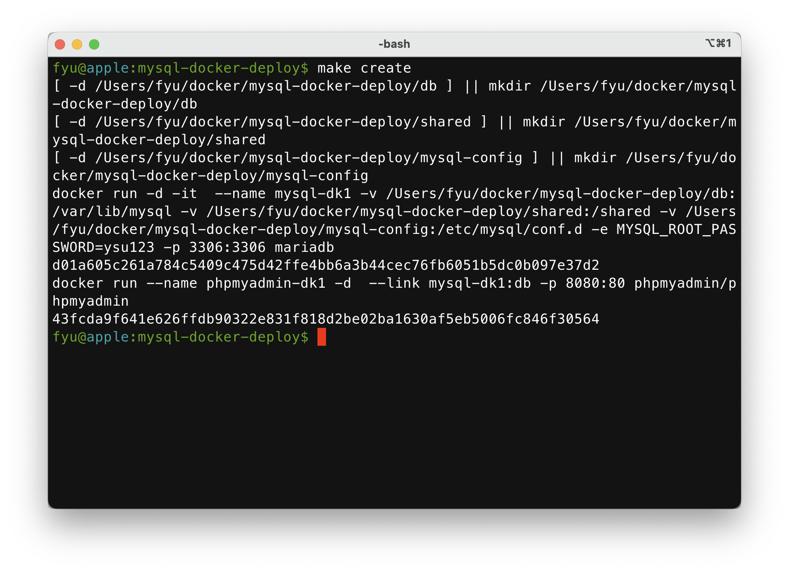
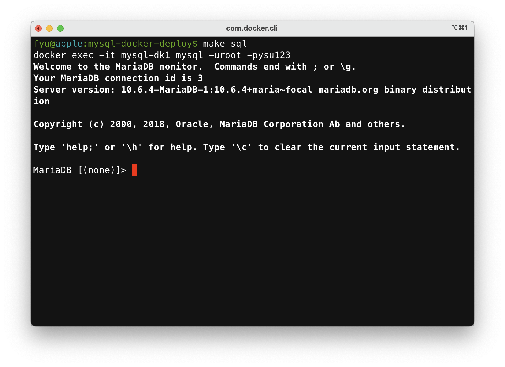
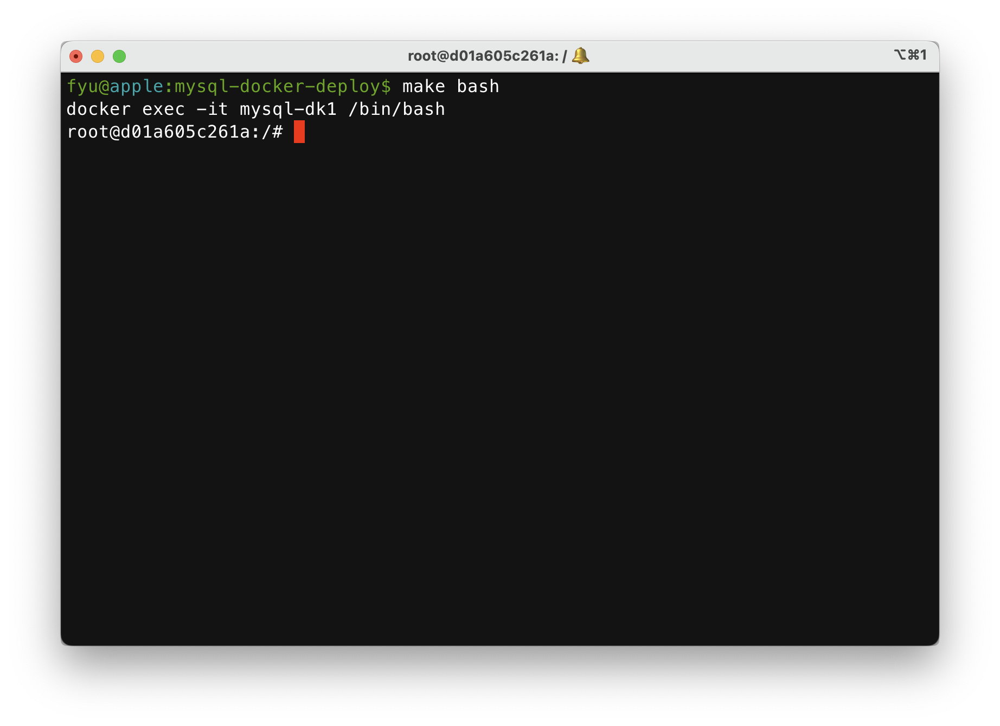
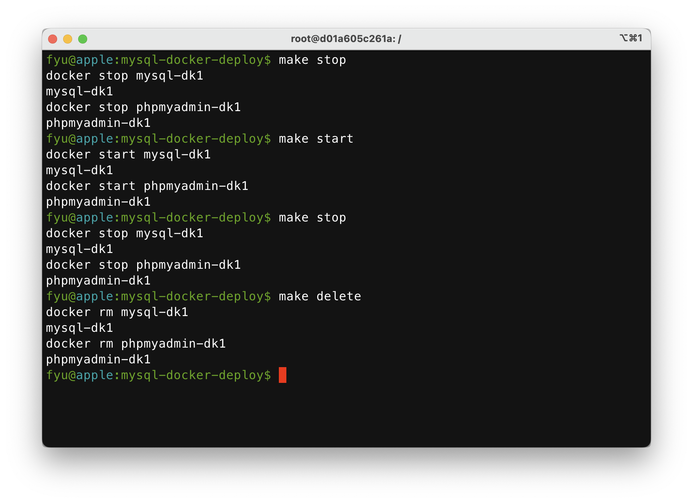

<!-- *Warning*: This script only works with docker mysql:5. The latest mysql 8.0 update the password plugin which may conflict with phpmyadmin login. It's advised to only use mysql:5 for now. -->

# required software

* Docker
    * https://docs.docker.com/engine/install/
* GNU make
    * mac: `brew install make`
    * centos: `sudo yum install make`
    * ubuntu: `sudo apt install make`

# mysql docker deploy


1. Clone this repo

```bash
git clone https://github.com/fenggeorgeyu/mysql-docker-deploy.git
cd mysql-docker-deploy
```


<!-- 1. Before start use docker to pull the images of mysql and phpmyadmin

    docker pull mysql:5
    docker pull phpmyadmin/phpmyadmin -->

1. To create the containers of mysql and phpmyadmin run

```bash
make create
```



1. To access phpymyadmin type in your web browser: `http://localhost:8080`. By default, the root password is `ysu123`. You may change the password by change the `passwd` in the makefile.

1. To access the SQL of MySQL

```bash
make sql
```



1. To access the bash of container

```bash
make bash
```



1. To stop containers

```bash
make stop
```

1. To start or resume containers

```bash
make start
```

1. To delete containers (need to stop containers first):

```bash
make delete
```



